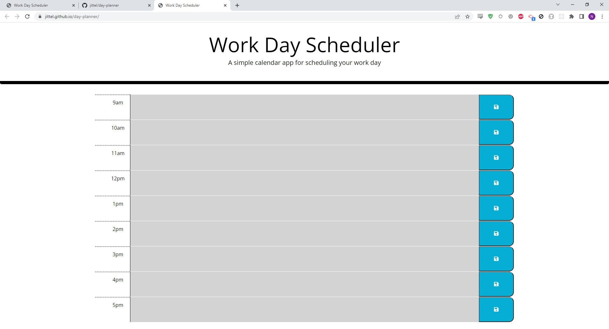

# day planner

an online mini calender do assist in daily planning

* enter text into the colored areas and hit save to add your reminder to the page

* item will stay even on refresh

* grey rows mean that you are past that time, green means future, red means current

[github](https://github.com/jittel/day-planner)

[app](https://jittel.github.io/day-planner/)

